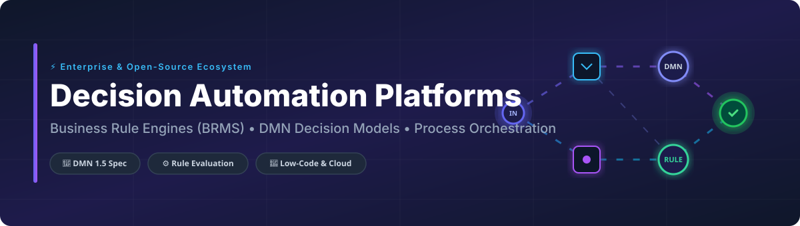

# Awesome Decision Automation Platforms ⚡

  
  
  
  
  

## 📌 Top Decision Automation Platforms Ecosystem

**Curated List of Enterprise SaaS Products & High-Performance Open-Source GitHub Projects**  
*Focused on Business Rule Engines (BRMS), DMN 1.5 Decision Models, Complex Event Processing (CEP), and Process Orchestration*  

**Last updated: October 2026** 📅

---

### 💡 What is Decision Automation?

This repository tracks notable **SaaS platforms** and **open-source projects** for **Decision Automation**, **Business Rules Management Systems (BRMS)**, and **Decision Intelligence Platforms (DIP)**. These tools empower enterprise decision architects, developers, and business analysts to model, execute, evaluate, and govern complex business decisions—decoupling decision logic from monolithic application codebases.

**Popular Category Leaders** include Pega, IBM ODM, Camunda, Decisions, Red Hat Decision Manager (IBM BAMOE), FICO Blaze Advisor, Drools, GoRules Zen, Flowable, and DecisionRules.io.

---

## 📊 Market Overview & Industry Dynamics

> [!NOTE]  
> **Market Size & Valuation**: The global **Business Rules Management System (BRMS)** market is estimated at **$1.9 Billion (2023)** and projected to surpass **$3.5 Billion by 2032** (~7% CAGR). The broader **Decision Intelligence & Digital Process Automation (DPA)** ecosystem is valued at over **$15.6 Billion (2024)** and expected to reach **$50+ Billion by 2030** driven by enterprise AI adoption and automated cloud decision services.

> [!IMPORTANT]  
> **Market Concentration & Structure**: The market is **moderately concentrated at the enterprise core** with legacy category leaders (IBM, Pega, FICO) maintaining substantial enterprise share. However, it is **highly fragmented at the innovator edge**, where cloud-native, low-code SaaS vendors (Decisions, DecisionRules.io, InRule) and high-performance open-source runtimes (Flowable, GoRules Zen, RuleGo) rapidly capture developer and mid-market adoption.

---

## 📑 Table of Contents

- [☁️ SaaS / Hosted Platforms](#-saas--hosted-platforms)
- [🔓 Open-Source GitHub Projects](#-open-source-github-projects)
  - [⚙️ BPMN & DMN Engine Platforms](#-bpmn--dmn-engine-platforms)
  - [🧠 Rule Engines & Decision Services](#-rule-engines--decision-services)
- [🤝 How to Contribute](#-how-to-contribute)
- [💖 Support & Sponsorship](#-support--sponsorship)
- [📈 Star History](#-star-history)
- [⚠️ Disclaimer](#%EF%B8%8F-disclaimer)

---

## ☁️ SaaS / Hosted Platforms

Below is a curated list of enterprise SaaS decision platforms, sorted by **Company Size / Valuation / Revenue (Descending)** 📉:

| Platform 🚀 | Company Size / Revenue / Valuation 🏢 | Description 📝 | Pricing (Starting Tier) 💰 | Free Tier / Trial Limits 🎁 |
| :--- | :--- | :--- | :--- | :--- |
| **[IBM ODM](https://www.ibm.com/)** | **~$62.0 Billion Revenue** (IBM Parent Market Cap ~$180B) | IBM Operational Decision Manager. Enterprise-grade decision automation platform with business rule engine, decision tables, and DMN decision modeling. | Enterprise cloud subscription starts around $2,500/month (or ~$120,000/year for core deployments) | 30-day free trial (IBM ODM on Cloud) |
| **[Red Hat Decision Manager](https://www.redhat.com/)** | **~$13.0 Billion Revenue** (Under IBM; now succeeded by IBM BAMOE) | Enterprise decision management platform built on Drools & Kogito. Delivers business rule management, DMN models, and real-time microservices. | Enterprise subscription starts at ~$12,000/year per CPU core/node | 60-day self-supported trial via Red Hat Developer Portal / IBM Developer |
| **[FICO Blaze Advisor](https://www.fico.com/)** | **~$1.6 Billion Revenue** (Fair Isaac Corp Market Cap ~$40B) | High-throughput enterprise business rules management system (BRMS). Provides decision automation with strict governance and financial compliance capabilities. | Enterprise licensing starts around $150,000/year | No public free trial; evaluation access provided via formal sales demo / proof-of-concept request |
| **[Pega](https://www.pega.com/)** | **~$1.4 Billion Revenue** (Pegasystems Public Market Cap ~$5B) | Enterprise decision automation and BPM platform. Delivers decision management, case management, and AI-powered decision strategies with Pega Platform. | Enterprise licensing starts around $97/user/month (Case Management edition) or $165/user/month (Enterprise edition) | 30-day free trial (Pega Platform Community Edition, extendable once for 15 days; 1 active instance limit) |
| **[InRule](https://inrule.com/)** | **~$250 Million Valuation** (PE-backed by OpenGate Capital) | Decision automation platform featuring rich rule engine authoring, decision modeling, and AI/ML model integration. | Commercial subscription starts around $9,500/month | 30-day free trial (limited to 1 named user, non-production evaluation) |
| **[Camunda SaaS](https://camunda.com/)** | **~$100 Million ARR** (Total Funding >$100M, Insight Partners) | Managed Camunda 8 cloud platform powered by Zeebe. Provides BPMN process orchestration, DMN decision models, and external worker microservice architecture. | Enterprise SaaS starts at ~$50,000/year (or custom core volume billing) | Free plan (5 users, 5 cluster reservations, non-production) + 30-day full feature trial |
| **[Decisions](https://decisions.com/)** | **~$50 Million Revenue** (Growth Equity backed) | Low-code business process and decision automation platform featuring visual rule designers, workflow engines, and enterprise integrations. | Enterprise licensing custom quoted; entry tier starts at ~$1,000/month | 7-day free trial (full enterprise license), reverts to non-expiring single-instance Personal License |
| **[FlexRule](https://flexrule.com/)** | **~$15 Million Revenue** (Bootstrapped / Private) | End-to-end decision automation and business rules platform. Combines business rules, decision models, data pipelines, and workflow orchestration. | Commercial licensing starts at ~$500/month per server node | 30-day free trial available upon request / evaluation registration |
| **[DecisionRules.io](https://decisionrules.io/)** | **~$5 Million ARR** (Series A / Cloud-Native Startup) | Modern cloud-native decision automation platform. Delivers API-first rule engines, decision tables, custom scripts, and low-latency rule execution. | Lite plan starts at €291/month (or €3,500/year) | Free Forever plan (1 user, 1 project, 10 rules/flows, 1,000 API calls/month) |

---

## 🔓 Open-Source GitHub Projects

The open-source ecosystem for business rules and decision engines is mature, high-performance, and standards-compliant. All repositories below are sorted by **GitHub Stars_Count (Descending)** ⭐:

### ⚙️ BPMN & DMN Engine Platforms

- **[Flowable](https://github.com/flowable/flowable-engine)**   
  **The most balanced open-source BPMN/DMN engine for Java.** **Apache 2.0 licensed**. Native BPMN 2.0, CMMN 1.1, and DMN 1.2 engines built on a fast, lightweight execution model. **Flowable 8.0** supports Spring Boot 4 and modern Java runtimes. **Best for**: Enterprise Java approval workflows, low-code process centers, and high-throughput decision execution.

- **[Apache KIE / Drools](https://github.com/apache/incubator-kie-drools)**   
  **The world's leading open-source Java rule engine with 99.91% DMN TCK conformance.** **Apache 2.0 licensed**. Features the RETE/PHREAK pattern-matching algorithm, DMN 1.5 decision tables, Complex Event Processing (CEP), and Kogito cloud-native microservices. **Best for**: Complex enterprise decision logic and high-conformance DMN evaluation.

- **[Camunda 7 Platform](https://github.com/camunda/camunda-bpm-platform)**   
  **The classic open-source BPMN & DMN process engine.** **Apache 2.0 licensed** (Community Edition). Includes Java process engine, DMN decision evaluator, Modeler, Cockpit, and Tasklist UI. **Note**: Camunda 7 is in maintenance mode; production use of Camunda 8 requires commercial licensing. **Best for**: Existing Camunda Java process deployments.

- **[GoRules Zen Engine](https://github.com/gorules/zen)**   
  **Ultra-fast, light-weight Rust & NodeJS decision engine for DMN-like decision tables and JSON rule evaluation.** **MIT licensed**. Executes decision graphs and decision tables in microseconds. Provides bindings for Python, NodeJS, Go, and Rust. **Best for**: Microservices requiring high-performance, low-latency decision table execution.

- **[jBPM](https://github.com/kiegroup/jbpm)**   
  **Flexible Java Business Process Management (BPM) suite.** **Apache 2.0 licensed**. Integrates business process orchestration with Drools rule evaluation and DMN decision execution. Part of the Apache KIE ecosystem. **Best for**: Java developers building integrated workflow and rule systems.

- **[RuleGo](https://github.com/rulego/rulego)**   
  **Lightweight, high-performance Go-based rule engine and event-driven decision orchestration framework.** **Apache 2.0 licensed**. Supports dynamic rule chain components, message routing, data filtering, and real-time IoT decision flows. **Best for**: Go applications, edge devices, and event-driven microservices.

- **[Operaton](https://github.com/operaton/operaton)**   
  **Community-driven open-source fork of Camunda 7.** **Apache 2.0 licensed**. Provides a drop-in open replacement for Camunda 7 BPMN process automation and DMN decision evaluation without vendor lock-in. **Best for**: Organizations maintaining Camunda 7 workflows under open community governance.

- **[CIB seven](https://github.com/cibseven/cibseven)**   
  **Independent open-source continuation fork of Camunda 7.** **Apache 2.0 licensed**. Includes process engine, web apps (Cockpit, Tasklist), and regular security/dependency updates. **Best for**: Open-source teams looking for continuous Camunda 7 platform maintenance.

- **[Bonita Engine](https://github.com/bonitasoft/bonita-engine)**   
  **Open-source Business Process Automation (BPA) and digital process platform.** **GPL 2.0 licensed** (Community Edition). Offers studio designers, web portal, UI builder, and extensibility connectors. **Best for**: Full-stack low-code process applications.

---

### 🧠 Rule Engines & Decision Services

- **[Automation Decision Engine](https://github.com/daveedashar/automation-decision-engine)**   
  **Python-based intelligent business rule engine and decision automation runtime.** Features YAML rule declarations, visual decision tree evaluation, production A/B testing of rule sets, and audit trails. **Best for**: Python applications needing flexible, declarative rule execution.

- **[OpenRules](https://github.com/openrules/openrules)**   
  **Business decision management system leveraging Excel-based decision tables.** Integrates rule execution with Java, .NET, and AWS Lambda serverless functions. **Best for**: Non-technical domain experts modeling logic in spreadsheets.

- **[Hyperon Engine](https://github.com/trueagi-io/hyperon-experimental)**   
  **Experimental declarative rule and pattern matching engine for neuro-symbolic AI and complex decision reasoning.** **Apache 2.0 licensed**. **Best for**: AI-driven symbolic decision systems.

- **[SemanticPolicy](https://github.com/semanticpolicy/semantic-policy)**   
  **Testable semantic decision runtime for .NET applications.** Measures rules on labeled examples for deterministic business logic and LLM agent policy control. **Best for**: .NET microservices integrating AI agent guardrails.

- **[JevPolicy](https://github.com/Sanoy24/jevpolicy)**   
  **TypeScript decision runtime turning probabilistic judgments into deterministic, replayable application decisions.** Features shadow evaluation, OpenTelemetry tracing, and semantic diffing. **Best for**: Node.js/TypeScript applications needing auditable decision policy execution.

---

## 🤝 How to Contribute

Contributions are welcome! Help us maintain the most comprehensive and accurate decision automation directory.

1. Fork this repository.
2. Add or update entries in `README.md` following the established table or badge structure.
3. Ensure entries include accurate pricing, links to official documentation, and factual star links.
4. Open a Pull Request with a clear summary of changes.

---

## 💖 Support & Sponsorship

If you find this curated list of **Decision Automation Platforms** helpful for your architectural research or project evaluation, please consider supporting the project!

- ⭐ **Star this repository** to help others discover it on GitHub.
- 🔀 **Fork & Share** it with your developer community, colleagues, and decision architects.
- ☕ **Buy me a coffee / Sponsor**: Support ongoing maintenance and open-source research via [GitHub Sponsors](https://github.com/sponsors/ishandutta2007).

  

---

## 📈 Star History

---

## ⚠️ Disclaimer

- This is a **community-curated** list for informational and educational purposes — not an endorsement of any vendor or platform.
- **Security & Governance**: Decision automation engines process sensitive business logic, policies, and customer data. Ensure appropriate RBAC, auditing, and compliance safeguards are implemented.
- **Open-Source Total Cost of Ownership (TCO)**: While open-source engines eliminate software licensing fees, operational TCO includes infrastructure management, custom developer integration, security patching, and ongoing maintenance.

---

  <b>Made with ❤️ for Business Analysts, Decision Architects, Java/Go/Python Engineers & Process Automation Teams.</b>

